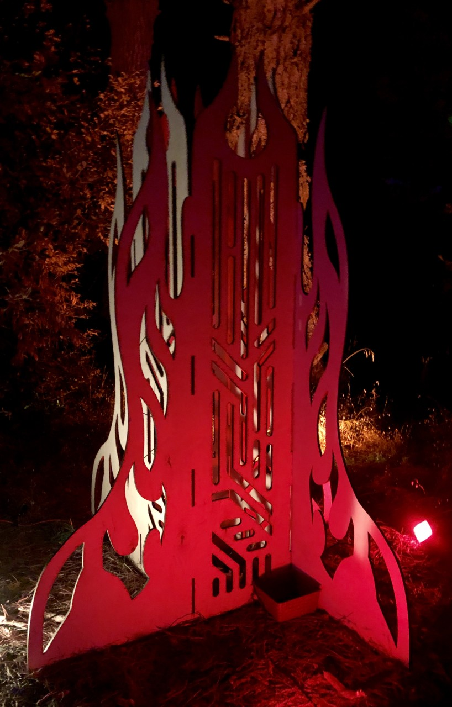
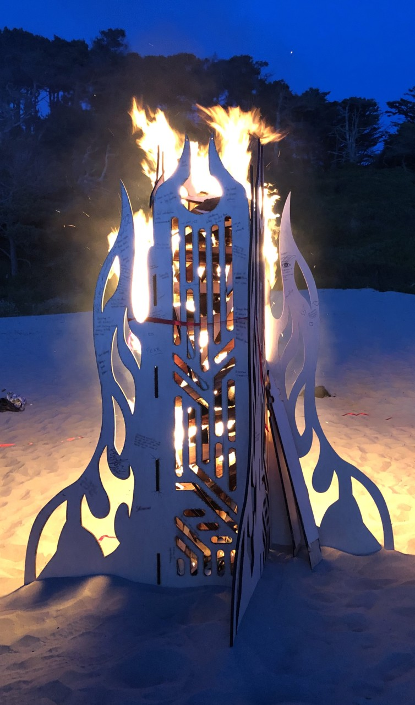
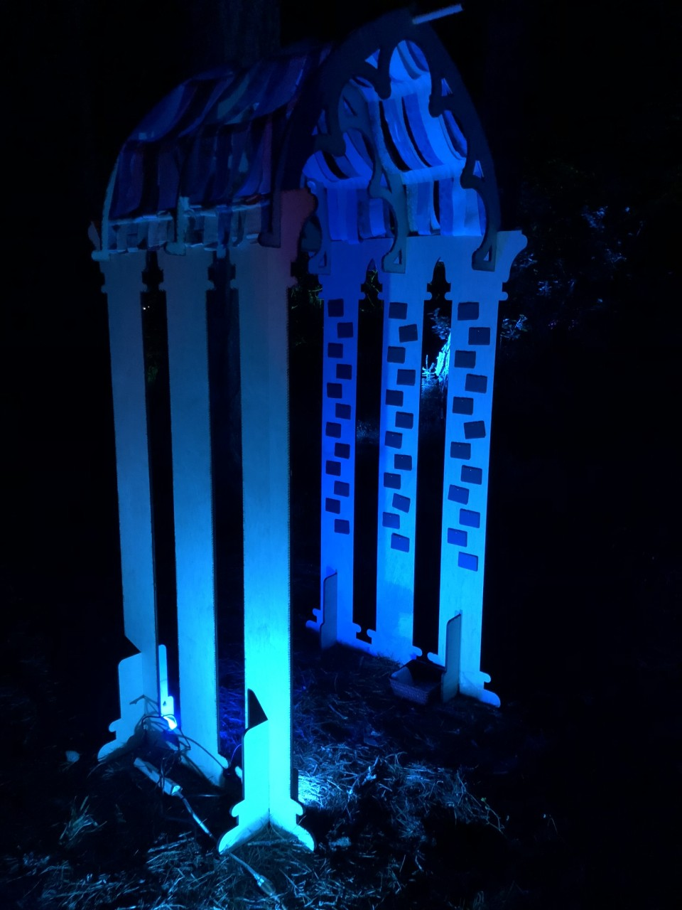

# OpenTemple

OpenTemple is a set of project files for quickly constructing laser-cut temples. Useful for events like community rituals, festivals, or weddings.

Designs are flexible to facilitate multiple uses. Original use and interpretations are included as a starting point.

Licensed under Creative Commons (CC-BY-SA 4.0)

## Temple of Release

.             |  .
:-------------------------:|:-------------------------:
  |  
  |  .

### Original Intention

People were invited to write what they wanted to let go of on the temple. Regrets, fears, negative mindsets, etc.

On the last day of the event, the temple was burned.

### Tools
  - 8' x 4' laser cutter

### Materials
  - 4x panels of 8' x 4' 1/2" plywood
  
### Notes
  - Holes at the top can be used to hang an object or speaker aloft in the middle.
  - Burning is easily facilitated by loading wood in from the top of the center chimney

## Temple of Invitation

.             |  .
:-------------------------:|:-------------------------:
  |  
  |  

### Original Intention

People were invited to write on slates what they wanted to bring more of into their life. These were hung on the walls of the temple, and later offered as gifts to take home.

### Tools
  - 8' x 4' laser cutter
  - (optional) hammer for hanging nails
  - (optional) [magnetic nail holder](https://www.homedepot.com/p/MASTER-MAGNETICS-Orange-Magnetic-Nail-Starter-97254/206503466)
  - (optional) saw to shorten dowel

### Materials
  - 3x panels of 8' x 4' 1/2" plywood
  - 1x [4' x 1" dowel](https://www.homedepot.com/p/6416U-1-in-x-1-in-x-48-in-Hardwood-Round-Dowel-10001808/203334068)
  - 44x 4' [fabric strips or ribbons](https://www.joann.com/jelly-roll-cotton-fabric-20-strips-2.5-assorted-gray-white-patterns/15216435.html)
  - 2x [packs of double sided adhesive](https://www.amazon.com/3M-110-3M-Scotch-Mounting-75-inches/dp/B00004Z498) (for attaching ribbons to each other and the sides of the temple)
  - (optional) 72x 1/2' nails
  - (optional) 72x [slate labels](https://www.amazon.com/gp/product/B00HCCZOW8)

### Notes
  - Can be built with or without slates. To match the slate pattern shown, offset each slate by 3 cm from the midline, with a nail every 10 cm vertically
  - Attach two fabric strips together with adhesive, drape over the top and adhere to each side after adjusting for desired draping
